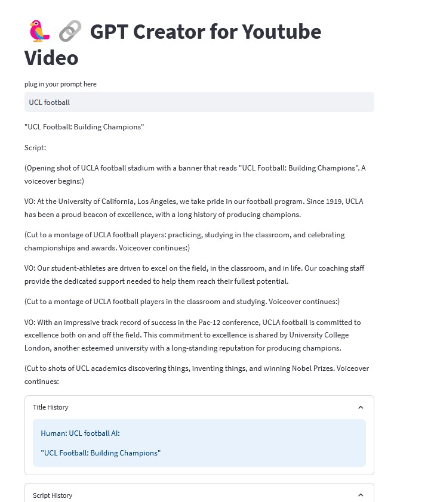

# GPT Creator for YouTube Video 🦜️🔗

Welcome to the GPT Creator for YouTube Video! This application leverages the power of Langchain and OpenAI's GPT-3 to assist you in generating compelling YouTube video titles and scripts. Whether you're a content creator or looking for inspiration, this tool can help you kickstart your creative process.

## Overview

- **Framework**: Langchain
- **User Interface**: Streamlit
- **Natural Language Model**: OpenAI's GPT-3
- **Language**: Python

## Dependencies

The project relies on several dependencies to provide its functionality:

- **Langchain Framework**: Langchain powers the AI content generation capabilities of this application.
- **Streamlit**: The user interface is built using Streamlit, providing an interactive and user-friendly experience.
- **OpenAI GPT-3**: The application leverages OpenAI's GPT-3 language model for natural language generation.
- **Python**: The entire project is developed in Python, making it highly versatile and adaptable.
- **WikipediaAPIWrapper**: This utility is used to fetch additional information from Wikipedia to enhance content generation.
- **ConversationBufferMemory**: A key component for storing and retrieving conversation history to maintain context.
- **ChromaDB**: Used for vector storage and data retrieval.
- **Tiktoken**: A backend tool to tokenize text for OpenAI.

### API Key

To use this application, you'll need an API key from OpenAI. 
1. Sign up or log in to your OpenAI account on the [OpenAI platform](https://beta.openai.com/signup/).

## Use

1. **Provide a Creative Prompt**: Begin by inputting your creative prompt into the designated text field. This prompt should encapsulate the essence of the content you want to create.

2. **Content Generation**: Once you have entered your prompt, the application will initiate its content generation process. It will utilize the Langchain framework and OpenAI's GPT-3 to generate a YouTube video title and a corresponding script based on the input prompt.

3. **Review Generated Content**: After the content generation is complete, you will be presented with both a YouTube video title and a script. Take the time to review and consider the generated content.

By following these steps, you can leverage the power of this application to kickstart your creative process and craft engaging YouTube video content.

## Demo

